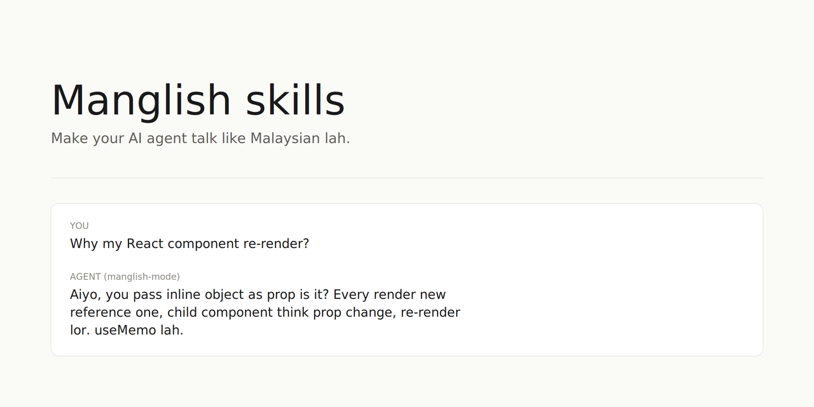

# Skills by Kai

Skills for switching how your AI agent talks. Malaysian voice, compressed output, cultural register.

## What's inside

Voice skills that change your agent's personality and communication style. These don't add new capabilities. They change how your agent responds: grammar, particles, loanwords, length, cultural tone. Built for Malaysian developers and anyone who wants their AI agent to sound less corporate.

## Skills

### Voice

#### manglish-mode

Full conversational Manglish. Warm, expansive, hospitable. Your agent responds like a Malaysian uncle/auntie who happens to know tech. Drops "to be" verbs, uses topic-comment order, sprinkles particles (lah, lor, mah, meh) and Malay/Hokkien loanwords naturally. No length cap.

Best for: customer service tone, casual chat, when the reply should feel human and friendly. Length matches what the topic needs.

Example:
> **You:** "Why my React component re-render?"
>
> **Agent:** "Aiyo, you pass inline object as prop is it? Every render new reference one, so child component think prop change, then re-render lor. `useMemo` lah, or move the object outside. Senang only."

[View full skill](skills/voice/manglish-mode/SKILL.md)

#### manglish-terse

Manglish with a hard length cap. Max 3 sentences per main point. No em dashes. No tricolons. No expansive paragraphs even for emotional topics. Same Malaysian voice, compressed delivery.

Best for: debugging, quick answers, daily technical use. Caveman energy with Manglish flavor.

Example:
> **You:** "Git rebase vs merge, when to use which?"
>
> **Agent:** "Rebase for clean linear history, use on feature branch before merge. Merge when branch shared with others, rewrite history break their refs. Default merge, rebase only your own stuff lor."

[View full skill](skills/voice/manglish-terse/SKILL.md)

### When to use which

**manglish-mode** when you want warmth and conversation. Explanations breathe, analogies land, replies feel like talking to a person. **manglish-terse** when you want speed. Debugging, quick lookups, daily technical back-and-forth where every extra sentence costs attention.

## What is Manglish?

Malaysian English. A creole that mixes English grammar with Malay, Hokkien, Cantonese, and Tamil influences. Spoken daily by ~30 million Malaysians across all races. Features include sentence-final particles (lah, lor, mah, meh), dropped articles and "to be" verbs, topic-comment sentence order, and heavy code-switching between languages mid-sentence. Not broken English. A distinct register with its own grammar rules, used in everything from mamak stall conversations to KL tech offices.

## Install

### Via skills installer (works with 14+ agents)

```
npx skills@latest add kaiyiwong/skills
```

Compatible with Claude Code, Cursor, Codex, Cline, Gemini CLI, GitHub Copilot, Amp, Antigravity, Deep Agents, Dexto, Firebender, Kimi Code CLI, OpenCode, and Warp.

### Via Claude Code plugin marketplace

```
/plugin marketplace add kaiyiwong/skills
/plugin install manglish-mode@kaiyiwong-skills
```

## Credits

Plugin manifest pattern, category-folder structure (`skills/category/skill-name/SKILL.md`), and the "skill is a folder with a SKILL.md" convention all borrowed from [mattpocock/skills](https://github.com/mattpocock/skills). Voice content and authoring standard are original.

## License

MIT
